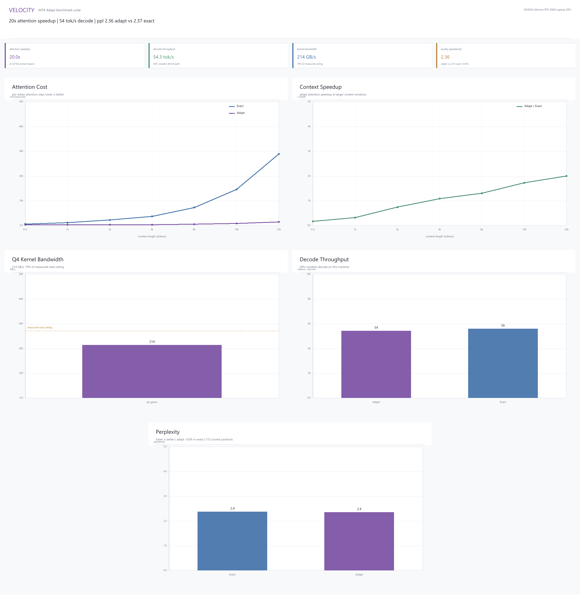
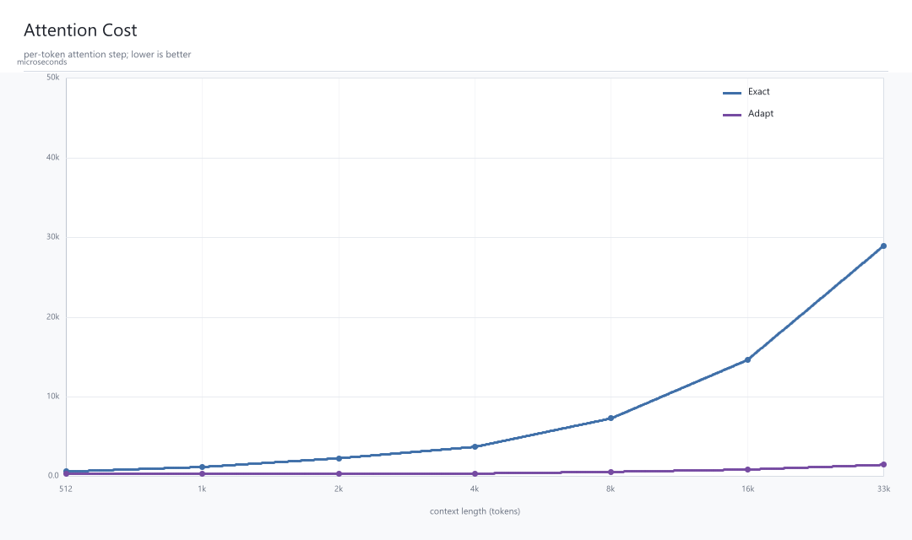
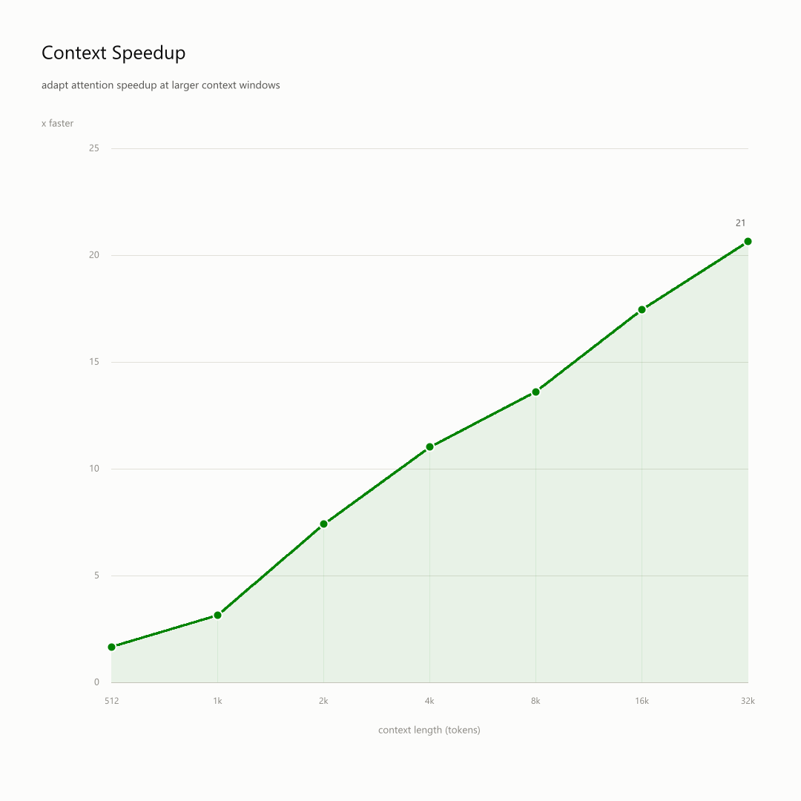
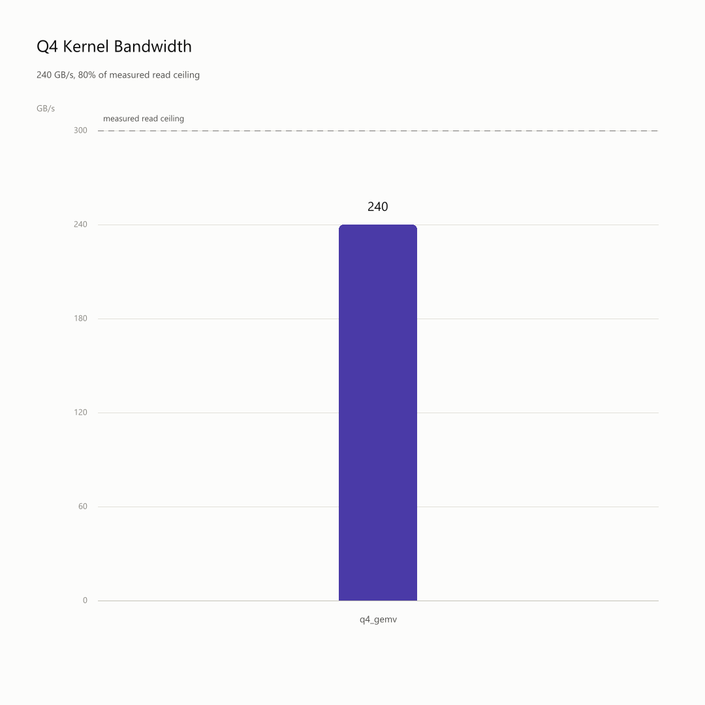
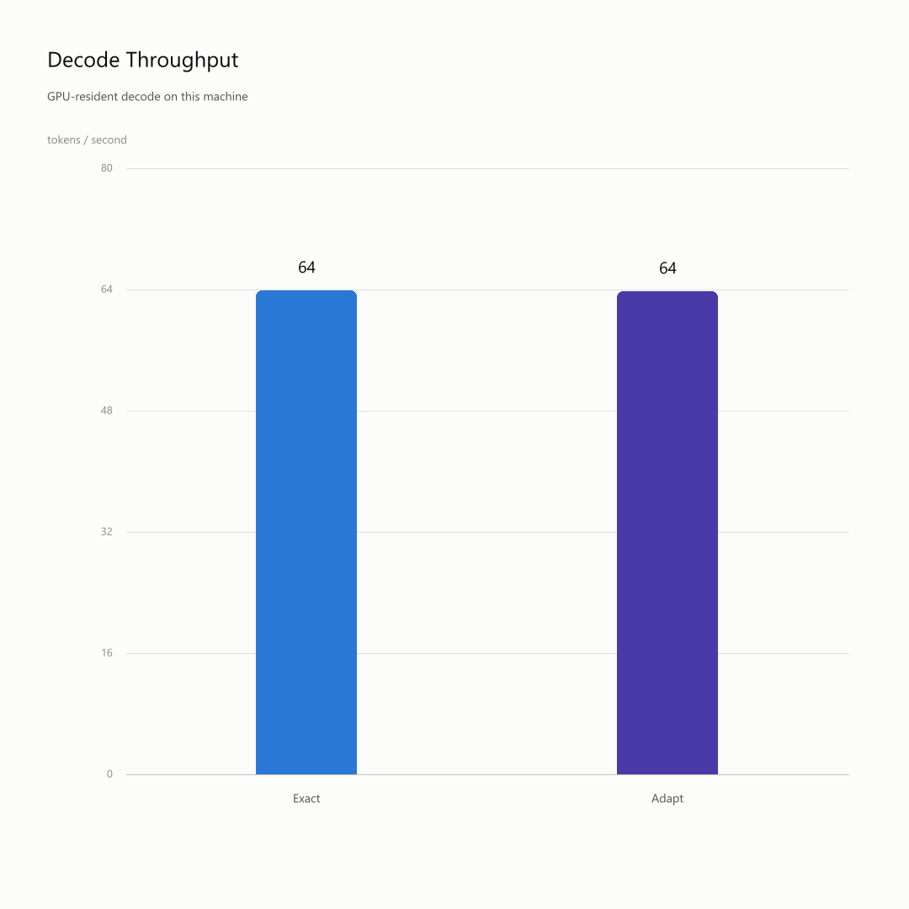
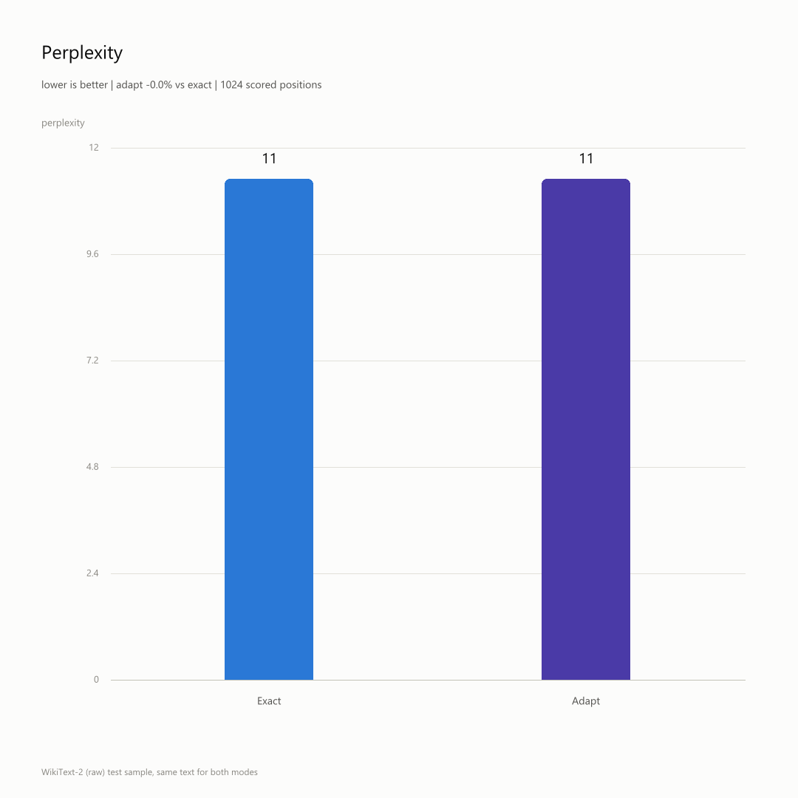

# ⚡ Velocity MTA Proof Build

### Existing models. No retraining. Verified local execution.

**Velocity is not another AI chat app.**

Velocity builds **Motify** — a native execution stack for local AI models based on sealed `.mfy` artifacts and **MTA**, the **Motify Transit Architecture**.

The chat is only the interface.  
The execution stack underneath is the product.

This proof build runs locally through the Velocity runtime.  
For the current public proof, the preferred execution path is **CUDA**.

Tested on:

```text
NVIDIA RTX 3060 Laptop GPU
6GB VRAM
CUDA backend
qwen3.5-4b-adapt-b32.mfy
```

---

## 🚀 Download

**Windows proof build:**

👉 [Download VeloSetup.exe](https://github.com/Veloresearch/velocity-mta-proof/releases/latest)

Model artifact:

👉 [Qwen `.mfy` artifact on Hugging Face](https://huggingface.co/veloresearch/qwen3.5-4b-adapt-b32)

The application can automatically download the required `.mfy` model artifact from Hugging Face on first run.

---

## 🧠 What is Velocity?

Velocity is a local AI execution system for `.mfy` model artifacts.

Instead of shipping another wrapper around an existing model, Velocity introduces a full runtime path:

```text
existing model
→ MTA compiler
→ sealed .mfy artifact
→ Velocity runtime
→ CUDA execution path
→ MTA Exact / MTA Adapt
→ local AI execution
```

This is not fine-tuning.  
This is not prompt engineering.  
This is not another hosted API wrapper.

**Velocity is building the execution layer underneath local AI models.**

---

## 🖥️ Preferred Execution Path: CUDA

The current Velocity proof build is designed around the **CUDA execution path**.

CUDA is currently the preferred backend for running this proof because it allows Velocity/Motify to keep model execution local while using consumer NVIDIA GPU hardware.

Current tested hardware:

```text
GPU: NVIDIA RTX 3060 Laptop GPU
VRAM: 6GB
Backend: CUDA
Runtime: Velocity / Motify
Artifact: qwen3.5-4b-adapt-b32.mfy
```

Observed local behavior on the tested machine:

```text
Prefill: ~63–66 tok/s
Decode:  ~52–55 tok/s
Backend: CUDA / GPU-resident Q4 path
Context: tested with large local context windows
```

Exact numbers may vary depending on GPU, drivers, CUDA version, thermal limits, VRAM availability, and runtime configuration.

For the current proof:

> **CUDA is the primary and preferred execution path.**

---

## 🧬 MTA — Motify Transit Architecture

**MTA** is the execution architecture inside Motify.

Velocity currently exposes two working MTA proof paths:

- ✅ **MTA Exact** — baseline / parity / verification path
- ⚡ **MTA Adapt** — no-retraining execution path for existing model families
- 🧬 **MTA Native** — future native model path designed directly for Velocity

> **Exact proves trust.**  
> **Adapt ships existing models.**  
> **Native breaks the ceiling.**

---

## ✅ MTA Exact

**MTA Exact** is the verification path.

It is designed for baseline comparison, auditability, and parity checks.

Use MTA Exact when you want to verify:

> Does this `.mfy` artifact preserve expected baseline behavior?

MTA Exact exists to build trust.

It gives developers a reference path before evaluating any optimized or adapted execution mode.

---

## ⚡ MTA Adapt

**MTA Adapt** is the current product path.

It runs existing model families through the Motify execution stack as sealed `.mfy` artifacts **without retraining**.

Use MTA Adapt when you want to test:

> Can this existing model run through Motify’s execution path without losing quality?

Current local proof:

```text
EXACT : ppl 2.373
ADAPT : ppl 2.364
Delta : -0.4% vs Exact
```

This is presented as a quality preservation result on the tested benchmark.

It should not be interpreted as a universal claim that Adapt improves every model in every setting.

The important point is simple:

> **MTA Adapt preserves baseline quality while running through a different execution path.**

---

## 📦 `.mfy` Artifacts

A `.mfy` file is a sealed Motify model artifact.

It packages model payload, tokenizer metadata, runtime configuration, and MTA execution metadata into a portable artifact designed for Velocity.

Current proof artifact:

```text
qwen3.5-4b-adapt-b32.mfy
```

The `.mfy` format is loaded by Velocity and executed through Motify.

Hugging Face stores `.mfy` artifacts as regular binary files.  
Velocity is the runtime that knows how to open and execute them.

The current proof build can automatically download the required `.mfy` artifact from Hugging Face during setup or first run.

---

## 🛠️ Motify Runtime

Motify is the runtime layer behind Velocity.

It manages:

- artifact loading
- automatic `.mfy` model download from Hugging Face
- tokenizer setup
- chat template setup
- runtime session state
- CUDA backend execution
- MTA path selection
- Exact / Adapt execution
- benchmark reporting
- execution inspection

The goal is to make local model execution inspectable, reproducible, and verifiable.

---

## 🗺️ MTA Execution Map

Velocity exposes the execution surface instead of hiding it.

The runtime can show:

- active MTA path
- context window usage
- layer activity
- SSM state path
- GQA / KV path
- FFN path
- selected execution mode
- CUDA execution status
- benchmark metrics

This makes the proof inspectable instead of just claimed.

---

## 📘 Execution Map Glossary

The MTA execution map exposes the internal execution surface of the currently loaded `.mfy` artifact.

### SSM — State Space Model

**SSM** stands for **State Space Model**.

In the Velocity execution map, SSM layers are shown as the short blue state bars.

Instead of relying on a large token-by-token attention window in every layer, an SSM-style path can maintain a compact working state.

This is important for speed and long-context behavior because the runtime burden does not grow as brutally with conversation length as full attention over the entire context.

In the map:

```text
SSM = compact state path
blue bars = bounded / constant-state execution path
```

### GQA — Grouped Query Attention

**GQA** stands for **Grouped Query Attention**.

It is a form of attention used by modern model architectures, including Qwen-family models.

In the Velocity execution map, GQA layers are shown as the fuller purple attention/KV bars.

These layers look into token context through the KV cache.

In the map:

```text
GQA = attention path
purple bars = selected KV / token-context path
```

### FFN — Feed-Forward Network

**FFN** stands for **Feed-Forward Network**.

It is the part of a model layer that processes the hidden state after the attention or state-space operation.

In transformer-style models, this is usually a large MLP block, commonly involving gate / up / down projections.

FFN blocks are computationally expensive because they involve large matrix operations.

In the map:

```text
FFN = dense compute path
full FFN path = feed-forward block remains active
```

### KV — Key / Value Cache

**KV** stands for **Key / Value cache**.

Classic attention-based models store key/value tensors from previous tokens so future tokens can attend back to earlier context.

This is powerful, but long context can consume significant VRAM or RAM because the cache grows with the number of tokens.

In the map:

```text
KV = attention memory
selected KV = token history used by attention layers
```

### O(1) State

**O(1) state** means a bounded working state whose size is treated as constant relative to the length of the conversation or source context.

Instead of growing a KV cache for every position in every relevant path, a bounded state path keeps a limited runtime state.

This is important for the MTA / Adapt narrative because the goal is not only to push more tokens into the model.

The goal is to control execution at the runtime layer.

In the map:

```text
O(1) state = bounded working state
dots / short bars = context not expanded into full attention cost
```

---

## 📊 Benchmarks

Benchmark cards and proof screenshots are available in the `/benchmarks` directory.

### Full Benchmark Overview



### Context Cost



### Context Speedup



### Kernel Bandwidth



### Decode Throughput



### Perplexity / Quality



Benchmark summary:

```text
benchmarks/summary.txt
```

---

## 🧪 Local Proof Release v0.1

We believe in runnable proof, not screenshots.

The v0.1 proof build lets you:

- install Velocity on Windows
- automatically download the required `.mfy` artifact from Hugging Face
- run `.mfy` artifacts locally
- use a local terminal chat
- run through the preferred CUDA execution path
- switch between MTA Exact and MTA Adapt
- benchmark Exact vs Adapt
- inspect the MTA execution map
- test adapted model artifacts locally
- verify that MTA Adapt does not require retraining

---

## ⚙️ Quick Start

### 1. Install Velocity

Download and run:

```text
VeloSetup.exe
```

Latest release:

```text
https://github.com/Veloresearch/velocity-mta-proof/releases/latest
```

### 2. Start Velocity

On first run, Velocity can automatically download the required `.mfy` model artifact from Hugging Face.

If you want to download it manually, use:

```bash
hf download veloresearch/qwen3.5-4b-adapt-b32 qwen3.5-4b-adapt-b32.mfy --local-dir ./models
```

Or download it from:

```text
https://huggingface.co/veloresearch/qwen3.5-4b-adapt-b32
```

### 3. Run the proof

If the model was downloaded automatically, simply start Velocity.

Manual run:

```bash
velocity.exe --model ./models/qwen3.5-4b-adapt-b32.mfy
```

Inside Velocity:

```text
/mode exact
/bench ppl
/mode adapt
/bench ppl
/inspect mta
```

---

## 📊 Current Proof Status

```text
MTA Exact        — working
MTA Adapt        — working
.mfy artifact    — working
Qwen artifact    — working
CUDA backend     — working / preferred
HF download      — automatic model download supported
Local chat       — working
PPL benchmark    — working
Execution map    — working
```

Gemma-family MTA proof is also part of the current internal validation path.

MTA Native is the future path for Motify-native models designed directly for Velocity’s execution stack.

---

## 🔥 Why This Matters

Velocity does not compete with Qwen, Gemma, Llama, or other model families.

Velocity builds the execution layer underneath them.

If existing model families can be converted into `.mfy` artifacts, verified through MTA Exact, and executed through MTA Adapt without retraining, then the value is not in one model.

The value is in the artifact standard and runtime.

```text
model → .mfy → Velocity Runtime → CUDA / MTA execution → local AI
```

And the current proof shows this running locally on consumer NVIDIA CUDA hardware.

---

## ❌ What Velocity Is Not

Velocity is not:

- another chat UI
- a prompt wrapper
- a hosted API skin
- a fine-tuning product
- a cloud-only demo
- a claim without a local proof path

Velocity is a local AI execution stack.

---

## 🧬 Roadmap

Current proof:

```text
Exact  → verification and trust
Adapt  → existing models through Motify
CUDA   → preferred current execution path
Native → future Motify-native execution
```

The current public proof focuses on **MTA Exact**, **MTA Adapt**, and the **CUDA execution path**.

MTA Native is the next step: models designed directly for Velocity’s execution stack.

---

## 📜 License

This repository contains a public proof build and packaged binaries for Velocity / Motify.

Velocity, Motify, MTA, the `.mfy` artifact format, runtime technology, compiler technology, execution architecture, and related tooling are proprietary Velocity technologies unless explicitly stated otherwise.

Model artifacts may follow the license of their upstream base models.

This repository does not grant permission to copy, modify, redistribute, reverse engineer, or reuse Velocity proprietary technology.

© 2026 Velocity / Velo Research. All rights reserved.

---

## 🔗 Links

- 🌐 Website: [veloresearch.com](https://veloresearch.com/)
- 📩 Contact: contact@veloresearch.com
- 📦 Artifact: `qwen3.5-4b-adapt-b32.mfy`
- 🤗 Hugging Face: [veloresearch/qwen3.5-4b-adapt-b32](https://huggingface.co/veloresearch/qwen3.5-4b-adapt-b32)
- 🖥️ Runtime: `velocity.exe`
- 🧠 Architecture: Motify / MTA
- ⚙️ Preferred backend: CUDA

---

## Don’t trust screenshots.

Run the artifact locally.

```text
Download it.
Run it.
Verify it.
Break it.
```

---

© 2026 Velocity / Velo Research. All rights reserved.
